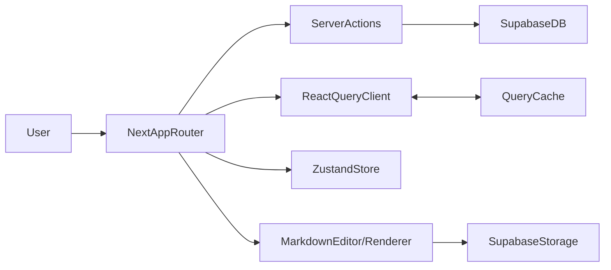
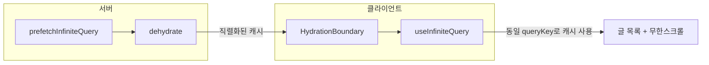

# MyBlog – 마크다운 기반 기술 블로그

> 모두 읽을 수 있지만 나만 정리할 수 있는 개발 블로그
>
> **배포**: https://myblog-navy-kappa.vercel.app/

Next.js App Router, Supabase, TanStack Query, Zustand를 활용해 구현한 **마크다운 기반 기술 블로그**입니다.  
해시태그·검색·댓글·좋아요·조회수와 관리자 전용 글 관리 기능을 통해, 개인 기술 학습과 기록을 실제 서비스 형태로 운영하는 것을 목표로 했습니다.

---

## 기술 스택

- **Framework**: Next.js 15 (App Router)
- **Language**: TypeScript
- **UI**: Tailwind CSS, shadcn/ui, lucide-react
- **State & Data**
    - 서버 상태: TanStack Query (React Query)
    - 클라이언트 전역 상태: Zustand
    - 폼/유효성 검사: Zod
- **Backend / Infra**
    - Supabase (PostgreSQL, Auth, Storage, RPC)
    - Vercel (배포, Analytics)

---

## 주요 기능

- **마크다운 글 작성/수정**
    - 실시간 미리보기, 드래그&드롭 이미지 업로드, 해시태그 자동완성
    - 글 제목/내용/해시태그에 대한 서버·클라이언트 유효성 검사(Zod)

- **검색·정렬·해시태그 필터**
    - 검색어(q) + 정렬 기준(최신/인기/좋아요/오래된 순) + 해시태그(tag)를 조합한 글 목록 조회
    - 다중 해시태그 AND 조건 필터(선택한 모든 해시태그를 포함하는 글만 조회)
    - React Query `useInfiniteQuery` + Intersection Observer 기반 무한 스크롤

- **소셜 기능**
    - 댓글/대댓글, 좋아요, 조회수 집계
    - 좋아요/댓글은 낙관적 업데이트를 적용해 즉각적인 UI 반응 제공(추후 useMutation 적용 예정)

- **Admin 전용 관리**
    - 관리자만 글 작성/수정/삭제 가능
    - `/admin`·`/profile` 등 보호 라우트에서 인증/권한 체크

- **UI/UX**
    - Tailwind CSS + shadcn/ui 기반 반응형 레이아웃
    - 다크 모드 지원, Skeleton UI 로딩 상태, 접근성을 고려한 컴포넌트 구성

---

## 아키텍처

- **Server Actions + Zod + Supabase**
    - 글/댓글/좋아요/이미지 업로드 등 핵심 도메인을 Next.js Server Actions에 모으고,
      Zod 스키마로 입력을 검증한 뒤 Supabase(PostgreSQL, RPC, Storage)를 호출하는 구조입니다.

- **TanStack Query 구조 (SSR + 쿼리 팩토리)**
    - **QueryClient 단일 경로**: `get-query-client.ts`에서 서버는 요청별 새 인스턴스(React `cache`), 클라이언트는 싱글톤을 반환하고, `QueryProvider`는 `getQueryClient()`만 사용해 suspend 시 재생성 방지.
    - **글 목록 SSR**: 서버에서 `prefetchInfiniteQuery` → `dehydrate` → `HydrationBoundary`로 전달하고, 클라이언트 `useInfiniteQuery`는 동일 queryKey로 hydrated 캐시만 사용(initialData 없음).
    - **쿼리 키 통일**: `lib/queries.ts`에 `postsListQueryKey`, `authQueryKeys`, `searchResultsQueryKey`를 두어 prefetch·useQuery·invalidate/remove 시 동일 키를 쓰도록 팩토리 패턴으로 관리합니다.

- **인증 / 권한 제어**
    - Supabase OAuth + Next.js Middleware + Server Actions + Zustand 조합으로
      `/admin`·`/profile` 같은 보호 라우트를 구성하고,
      Admin 권한 여부에 따라 UI와 서버 로직을 모두 제한합니다.

- **SEO**
    - App Router의 `metadata` / `generateMetadata`를 활용해 페이지별
      title/description/OG/JSON-LD를 구성하고, `sitemap.xml`, `robots.txt`를 포함해
      검색 엔진이 크롤링·색인하기 좋은 구조로 설계했습니다.

간단한 데이터 흐름은 다음과 같습니다.



글 목록 페이지에서 TanStack Query가 서버 데이터를 클라이언트로 넘기는 흐름은 아래와 같습니다.



---

## 기여한 부분

이 프로젝트는 설계부터 개발·배포까지 개인 프로젝트로 직접 구현했습니다.

- **성능 최적화**
    - Skeleton UI와 TanStack Query 기반 무한 스크롤 캐싱 전략을 도입해
      게시글 목록·검색 결과의 초기 로딩 체감 속도와 스크롤 시 렌더링 지연을 줄였고,
      Lighthouse Performance 99점, LCP 약 0.5초 수준의 로딩 성능을 달성했습니다.

- **SEO 품질 확보**
    - `generateMetadata`·시맨틱 태그·JSON-LD·`sitemap.xml`·`robots.txt`를 조합해
      Lighthouse SEO 100점을 달성하고, 검색 엔진 노출을 고려한 구조로 리팩터링했습니다.

- **검색/필터링 UX 및 권한 제어**
    - `URLSearchParams` + React Query `useInfiniteQuery`를 조합해 검색어(q), 해시태그(tag),
      정렬(sort) 상태를 URL에 동기화하고, 뒤로가기·새로고침 시에도 검색 맥락이 유지되도록 설계했습니다.
    - Supabase RPC(`get_posts_with_all_hashtags`)와 복합 인덱스를 활용해
      여러 해시태그를 모두 포함하는 게시글만 반환하는 AND 필터와 정렬 기준(최신/인기/좋아요/오래된 순)에
      따른 안정적인 응답을 구현했습니다.
    - Supabase OAuth + Middleware + Server Actions + Zustand 조합으로 인증/인가 흐름을 설계하고,
      `/admin`·`/profile` 등 보호 라우트에서 Admin 권한 여부에 따라 UI와 서버 로직을 이중으로 제어했습니다.

---

## 간단한 폴더 구조

```text
src/
  app/                # Next.js App Router 페이지/레이아웃
    auth/             # 로그인/콜백 등 인증 관련 라우트
    posts/            # 글 목록, 상세 페이지
    admin/            # 관리자 전용 글 작성/수정 페이지
    search/           # 검색 페이지
    profile/          # 프로필 페이지

  components/
    editor/           # Markdown 에디터/렌더러
    comments/         # 댓글/대댓글 컴포넌트
    likes/            # 좋아요 버튼
    hashtags/         # 해시태그 사이드바/검색
    layout/           # Header, Footer 등 레이아웃
    ui/               # 공통 UI(shadcn/ui 래퍼)

  lib/
    actions.ts        # Server Actions (글/댓글/좋아요 등)
    posts.ts          # 게시글 관련 도메인 로직
    comments.ts       # 댓글 관련 도메인 로직
    likes.ts          # 좋아요 관련 도메인 로직
    hashtags.ts       # 해시태그 관련 도메인 로직
    file-upload*.ts   # Supabase Storage 파일 업로드/정리
    get-query-client.ts # TanStack QueryClient (서버/클라이언트 단일 경로)
    queries.ts        # 쿼리 키 팩토리 (posts, auth, search)
    query-provider.tsx # QueryClientProvider (getQueryClient 사용)
    schemas.ts        # Zod 스키마 모음

  utils/
    supabase/         # 클라이언트/서버/미들웨어용 Supabase 래퍼

  stores/
    auth-store.ts     # 인증 관련 Zustand 스토어
```
