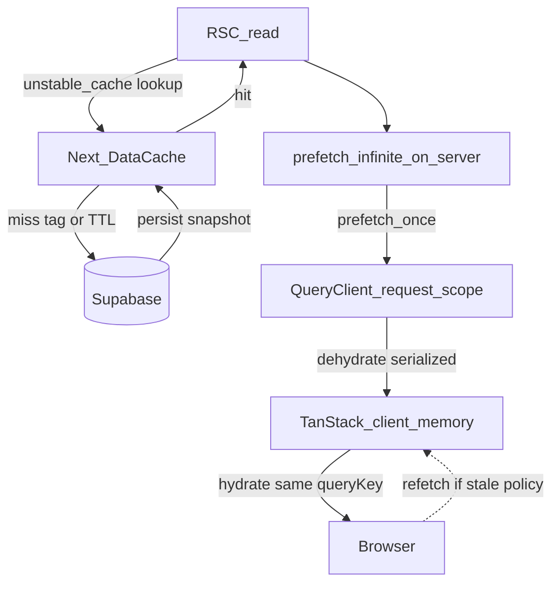
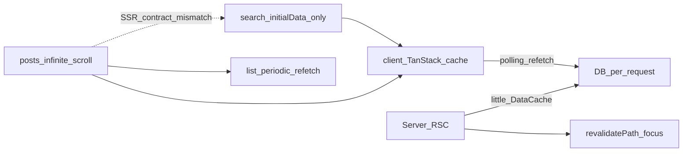
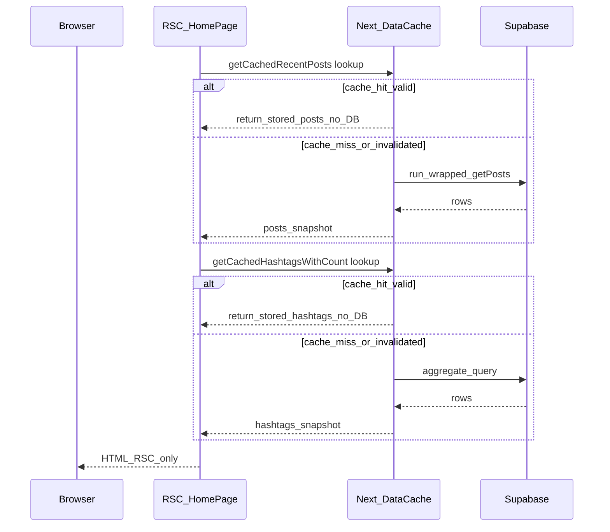
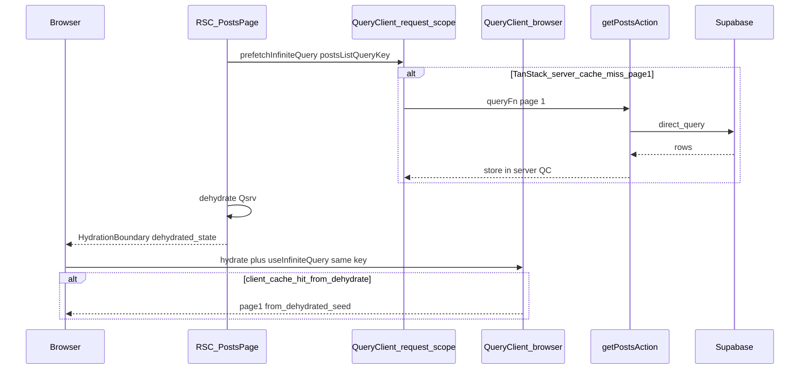
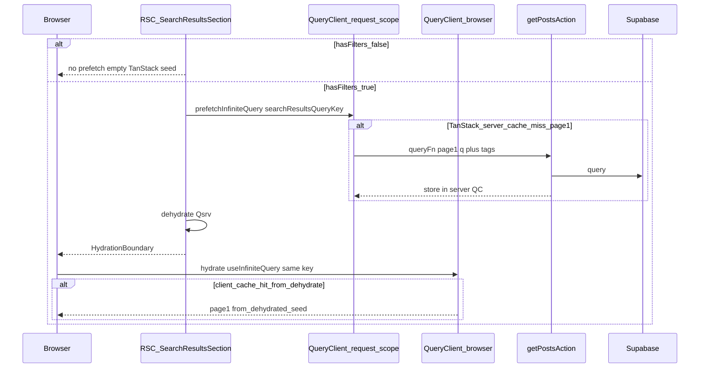
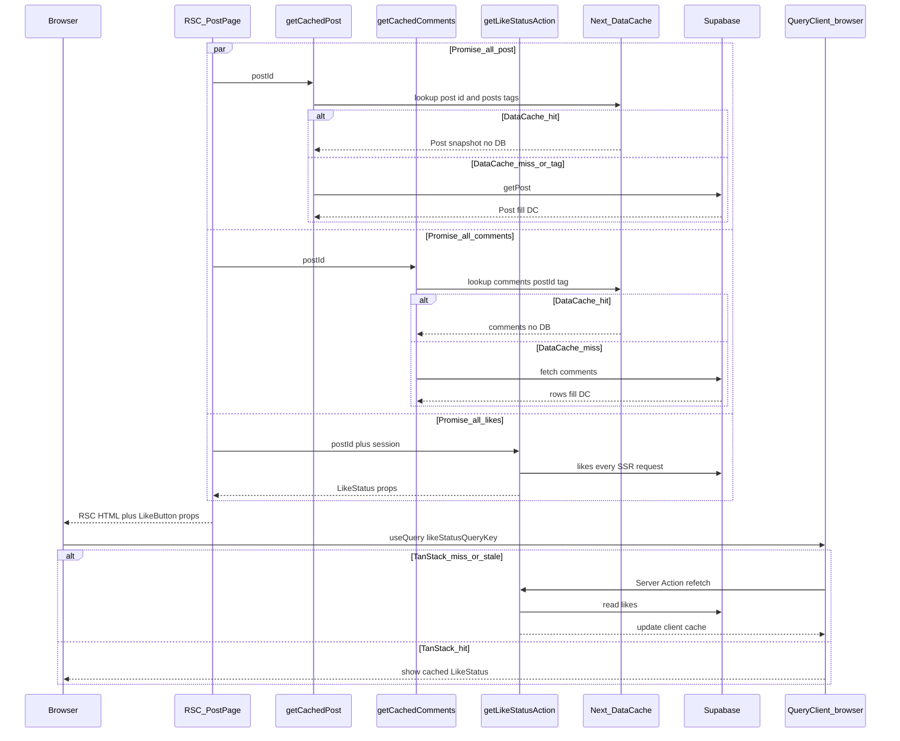
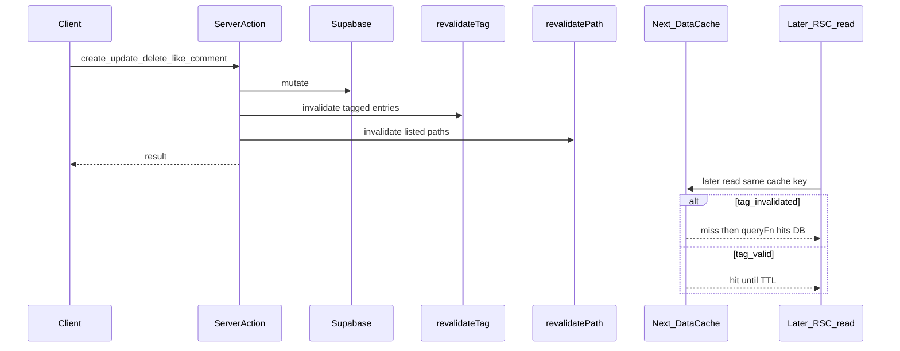

# 포트폴리오 기록: Next.js 15 + TanStack Query v5 캐싱 최적화

## 한 줄 요약 (이력서용)

Next.js 15 **Data Cache**(`unstable_cache`, `revalidateTag`)와 TanStack Query v5 **SSR prefetch**(`prefetchInfiniteQuery`, `dehydrate`, `HydrationBoundary`)를 맞춰, 정적 블로그 읽기 경로의 서버·클라이언트 캐시 계층을 정리했다.

## 문제 정의

- 홈·글 상세는 매 요청마다 DB 조회에 가깝게 동작하고, 무효화는 `revalidatePath` 위주였다.
- 글 목록(`/posts`)은 infinite query + prefetch 패턴이었으나 검색(`/search`)은 `initialData`로만 첫 페이지를 넘겨 패턴이 달랐다.
- 목록 클라이언트에서 **주기적 refetch**(폴링)가 있어 정적 콘텐츠에는 과했다.

## 기술 선택

| 구분            | 선택                                                        | 이유                                                  |
| --------------- | ----------------------------------------------------------- | ----------------------------------------------------- |
| 서버 읽기 캐시  | `unstable_cache` + `tags` + `revalidate`                    | RSC/Server에서 Supabase 조회 결과를 Data Cache에 탑재 |
| 변경 시 무효화  | `revalidateTag` + 기존 `revalidatePath` 유지                | 태그 단위로 목록/상세/댓글 등 선택 무효화             |
| 무한 스크롤 SSR | `prefetchInfiniteQuery` → `dehydrate` → `HydrationBoundary` | 공식 SSR 가이드와 동일한 단일 prefetch 계약           |
| Query key       | `['posts', { sort, tag }]`, `['search', { q, tag }]`        | searchParams 성격을 객체 한 덩어리로 식별             |

## 구현 요약 (Phase별)

### Phase 1 — 태그·래퍼

- `src/lib/cache-tags.ts`: `posts`, `post-{id}`, `hashtags`, `comments-{postId}`.
- `src/lib/posts.ts`: `getCachedPost`, `getCachedRecentPosts` (`revalidate: 3600`).
- `src/lib/hashtags.ts`: `getCachedHashtagsWithCount`, **`getCachedHashtagById`** (`revalidate: 3600`, 태그 `hashtags` — `generateMetadata`·필터 메타용).
- `src/lib/comments.ts`: `getCachedComments` (`revalidate: 60`).

### Phase 2 — Mutation과 `revalidateTag`

- `src/lib/actions.ts`: 글 생성·수정·삭제, 댓글 CRUD, 좋아요 토글 후 해당 태그 `revalidateTag`.
- 읽기 전용 액션은 캐시 래퍼를 호출하도록 연결 (`getPostAction` → `getCachedPost` 등).

### Phase 3 — 페이지

- `src/app/page.tsx`: `getCachedRecentPosts`, `getCachedHashtagsWithCount` 직접 사용.
- `src/app/posts/[id]/page.tsx`: `getCachedPost`, `getCachedComments` (좋아요 상태는 user별이라 비캐시).

### Phase 4 — Query key

- `src/lib/queries.ts`: 객체 형태 키로 통일.
- `src/components/posts/PostWrapper.tsx`: 동일 키로 `useInfiniteQuery` 유지.

### Phase 5 — 검색 Hydration

- `src/app/search/page.tsx`: 조건이 있을 때만 `prefetchInfiniteQuery`, `getNextPageParam`은 클라이언트와 동일.
- `src/components/search/SearchResultsWrapper.tsx`: `initialData` 제거, `enabled: hasFilters`, 요약용 `total`은 `data.pages[0].total`.

### Phase 6 — 클라이언트 폴링 정리

- `PostWrapper`: `refetchInterval` / `refetchIntervalInBackground` 제거, `refetchOnWindowFocus: false`.

### Phase 7 — 좋아요 동기화·해시태그 단건 캐시 (정책 보완)

- **`getCachedHashtagById`**: `getHashtagByIdAction` → Data Cache, 글 CRUD 시 `hashtags` 태그 무효화로 일치.
- **좋아요**: `getLikeStatusAction`은 Data Cache 미사용(세션·쿠키 기반). `LikeButton`에서 `useQuery`(`likeStatusQueryKey`) + **`refetchOnWindowFocus`** 로 탭 복귀 시 서버와 재동기화. 토글은 `setQueryData` + 낙관적 업데이트.

## Before / After

| Before                              | After                                     |
| ----------------------------------- | ----------------------------------------- |
| 서버 읽기 전용 Data Cache 거의 없음 | `unstable_cache` + 태그 기반 ISR 성격     |
| 무효화 path 위주                    | 태그로 목록/상세/댓글 등 범위 조절        |
| 검색은 initialData만                | `/posts`와 동일한 Hydration prefetch 패턴 |
| 목록 2분 폴링                       | 폴링 제거, 정적 블로그에 맞춤             |

## Git 리팩터와 Phase 매핑

리팩터는 저장소 커밋과 위 Phase가 대략 아래처럼 대응한다.

| Git                                                       | Phase·내용                                                                                                                                                                               |
| --------------------------------------------------------- | ---------------------------------------------------------------------------------------------------------------------------------------------------------------------------------------- |
| `ce610e1` — _refactor: SSR hydration 정석 패턴 적용_      | Phase 3~4 요지: `getQueryClient`, `prefetchInfiniteQuery`, `dehydrate`, `HydrationBoundary`; `src/app/posts/page.tsx`, `PostWrapper`, `get-query-client`, `query-provider`, `queries.ts` |
| `1bc1f10` — _refactor: 쿼리 키 팩토리로 auth·search 통일_ | Phase 4~5 보조: `authQueryKeys`, `searchResultsQueryKey` 정리                                                                                                                            |

Phase 1~2는 Data Cache·`revalidateTag` 도입, Phase 5~6은 검색 Hydration·폴링 제거, Phase 7은
좋아요·`getCachedHashtagById` 보완 등으로 별도 커밋에 누적된 상태다.

## 캐싱 흐름 (Mermaid)

Next.js **Data Cache**(`unstable_cache`, `tags`, `revalidate`)와 TanStack Query
**SSR prefetch**(`prefetchInfiniteQuery` → `dehydrate` → `HydrationBoundary`),
클라이언트 `useInfiniteQuery` / `useQuery`가 어느 경로에서 겹치는지 시각화한다.

### 계층 개요

**설명:** RSC는 `unstable_cache`에 **먼저 조회**하고, 히트면 DB 없이 스냅샷을
쓴다. 미스·무효화·TTL 만료 시에만 내부 `queryFn`이 DB를 채운다. 목록·검색은
요청 단위 서버 `QueryClient`에 prefetch로 넣은 뒤 **dehydrate → hydrate**로
브라우저 TanStack 메모리 캐시를 시드하며, 이후 **같은 `queryKey`면 메모리
히트**로 네트워크를 생략할 수 있다(`staleTime`·`refetchOnMount` 정책 적용).

### Before: 리팩터 이전 개념

**설명:** 서버 측 **Data Cache**(`unstable_cache`)는 거의 없어 RSC가 DB에
가깝게 붙었고, 무효화는 `revalidatePath` 위주였다. 클라이언트 TanStack 캐시는
있으나 목록은 **폴링**으로 주기적으로 DB를 다시 두드렸다. 검색은
`initialData`만으로 첫 화면을 맞추는 등 SSR과의 **키·프리패치 계약**이 목록과
어긋났다(Phase 5~6에서 정리).

### After: 홈 `/`

**설명:** 홈은 TanStack을 쓰지 않고, **`unstable_cache` 히트 시 DB를 건너뛴다**.
미스 후 DB에서 채운 스냅샷은 **TTL·`revalidateTag` 전까지** Data Cache에
유지된다. `Promise.all`로 최근 글·해시태그 조회를 병렬로 마친 뒤 한 번에 RSC
HTML을 만든다.

### After: 글 목록 `/posts`

**설명:** 서버 `QueryClient`는 **요청마다 비어 있는 상태에서** prefetch로 page1만
채운다(`getPosts`는 Next Data Cache를 타지 않음). `dehydrate`로 넘긴 값이
클라이언트 캐시를 **시드**하므로, 같은 `postsListQueryKey`면 첫 페이지는
**히트**로 그려지고 `staleTime` 등에 따라 백그라운드 재검증 여부가 정해진다.
무한 스크롤로 **다음 페이지**를 불러올 때는 `fetchNextPage`가 `getPostsAction`을
다시 호출해 DB를 읽는다. **홈 카드**의 `likes_count` 등은 여전히
`getCachedRecentPosts` Data Cache·태그와 연동된다.

### After: 검색 `/search`

**설명:** **필터가 있을 때만** 서버에서 prefetch해 dehydrate한다. 필터가 없으면
쿼리 키로 시드하지 않고, 클라이언트는 `enabled: hasFilters`로 무한 쿼리를 끈다.
필터가 있는 세션에서는 목록과 같이 **hydrate된 메모리 캐시 히트**로 첫 페이지를
재사용할 수 있다. 다음 페이지는 `fetchNextPage`→DB.

### After: 글 상세 `/posts/[id]`

**설명:** 글·댓글은 **`unstable_cache` 히트 시 DB를 생략**한다. 좋아요
(`getLikeStatusAction`)는 **`unstable_cache`에 넣지 않고** 매 SSR 요청·클라이언트
refetch마다 DB·세션을 본다.
`LikeButton`은 TanStack으로 그 결과를 **메모리에 캐시**하되 `staleTime: 0` 등으로
재진입 시 서버와 다시 맞춘다.

### Mutation 이후 무효화

**설명:** `revalidateTag`로 해당 태그가 붙은 **Next Data Cache** 엔트리가 무효화되면,
이후 RSC가 같은 `unstable_cache` 래퍼를 호출할 때 **미스**로 보고 DB를 다시
채운다. 태그가 안 건드려지면 **TTL** 동안은 여전히 히트할 수 있다.
`revalidatePath`는 라우트 단위 캐시를 비우는 역할에 가깝다. **TanStack 브라우저
캐시**는 서버 무효화만으로는 비워지지 않으므로, 필요 시 `invalidateQueries`·
refetch로 맞춘다. 좋아요 토글 후 path·tag 무효화를 두면 카드·JSON-LD의
`likes_count` Data Cache 스냅샷이 빨리 맞는다.

## 트레이드오프·의도된 설계

### 조회수 vs `getCachedPost` 스냅샷

- 조회수는 **정확히 실시간 일치할 필요가 낮다**고 보고, 화면 숫자는 캐시된 글 객체의 `view_count`를 따른다.
- DB에서는 매 방문 `increment_view_count` RPC로 올라가지만, **Data Cache 엔트리는 `revalidate`·`revalidateTag` 전까지 갱신되지 않는다** (Next.js Data Cache 동작).
- 정책: **가끔 맞으면 됨** — 관리자가 글을 수정하거나 좋아요 등으로 `post` 태그가 무효화될 때 함께 맞춰지고, 그 외에는 TTL(3600초) 백업.

### 좋아요 — Data Cache에 `(postId, userId)` 넣지 않음

- 공식 가이드대로 사용자별 분기가 필요하면 캐시 키에 userId를 넣을 수 있지만, **사용자 수 × 글 수**만큼 캐시 항목이 늘 수 있다.
- 대안: **공용 본문**은 `getCachedPost`, **내가 눌렀는지·현재 합계**는 **요청마다** `getLikeStatusAction`(Supabase 세션)으로 조회.
- 클라이언트는 **TanStack Query**로 같은 데이터를 캐시하고, **`refetchOnWindowFocus`** 로 다른 탭/기기 이후에도 서버와 맞춘다.

요약: **개인화는 Data Cache가 아니라 “세션 + 클라이언트 Query” 쪽에 둔다.**

### `unstable_cache`의 `revalidate` (초) 점검

| 경로·함수                    | 현재 값          | 해석                                                                                                        |
| ---------------------------- | ---------------- | ----------------------------------------------------------------------------------------------------------- |
| `getCachedPost`              | **3600** (1시간) | 글 본문·메타. 관리자 변경 시 `revalidateTag`로 즉시 무효화되므로 TTL은 _백업_ 역할. 개인 블로그에는 무난함. |
| `getCachedRecentPosts`       | **3600**         | 홈 최신 6개. 글/해시태그 변경 시 태그로 무효화.                                                             |
| `getCachedHashtagsWithCount` | **3600**         | 사이드바 인기 태그. 글 CRUD 시 `hashtags` 태그 무효화.                                                      |
| `getCachedHashtagById`       | **3600**         | 단건 메타(`generateMetadata` 등). 동일 `hashtags` 태그 무효화.                                              |
| `getCachedComments`          | **60** (1분)     | 댓글 CRUD마다 태그 무효화. 60초는 태그 누락 시에도 비교적 빨리 복구되는 **보수적** 값.                      |

**적절성 요약:** mutation이 앱을 통해서만 일어난다는 전제면 **3600은 과하지 않고**, 태그와 잘 맞는다. 트래픽이 매우 높고 DB 부담만 줄이고 싶다면 글·목록·해시태그를 **7200~86400**까지 늘릴 여지는 있다(태그 신뢰가 전제). 댓글은 **60~300초** 사이에서 조정 가능(60 = 신선도 우선, 300 = 읽기 부하 우선).

코드 위치: `src/lib/posts.ts`, `src/lib/hashtags.ts`, `src/lib/comments.ts`.

## 향후 과제

- 프로덕션에서 TTFB·DB 쿼리 수 간단 측정.
- `docs/` 본 문서를 발표/포트폴리오 사이트에 링크해 두기.

_(해시태그 단건: `getCachedHashtagById` + `hashtags` 태그 연동 반영됨.)_

---

_작성일: 2026-03-28 · 프로젝트: myblog_
