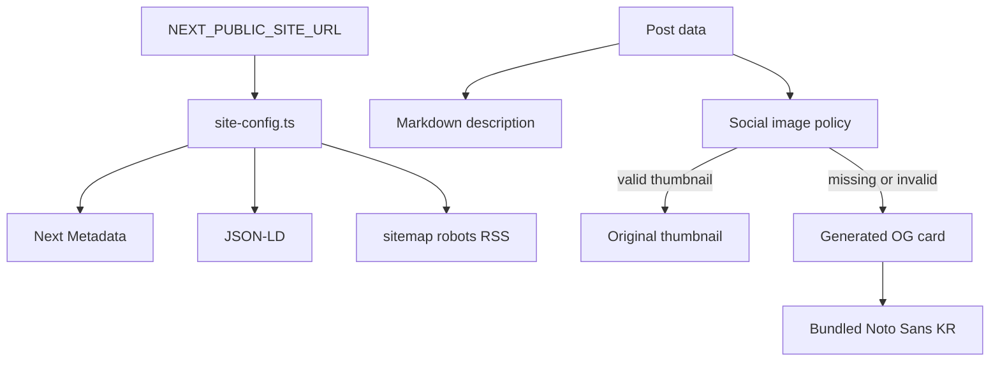

# myblog SEO·색인·소셜 공유 구현 가이드

이 문서는 myblog 저장소에 적용된 SEO 개선을
파일과 검증 명령 중심으로 설명한다. `blog publish` 자동화, 실제 배포,
Search Console 등록과 색인 요청은 이 작업에 포함하지 않는다.

## 구현 의도와 기대 결과

이번 작업의 의도는 검색엔진과 공유 플랫폼이 매 요청에서 같은 사이트 주소와
콘텐츠 정보를 받게 만드는 것이다.

- canonical·JSON-LD·sitemap·robots·RSS가 동일한 사이트 URL을 사용한다.
- 게시글에 썸네일이 있으면 해당 이미지를 공유 카드로 사용한다.
- 썸네일이 없으면 한글 제목이 포함된 브랜드 카드를 생성한다.
- OG 카드 생성이 외부 폰트 네트워크 상태에 영향을 받지 않는다.
- 검색 결과 페이지는 색인하지 않지만 결과 안의 게시글 링크는 따라가게 한다.

## 데이터 흐름



## 주요 파일

| 파일 | 역할 |
| --- | --- |
| `src/lib/site-config.ts` | 사이트 URL 필수 검증·정규화·절대 URL 생성 |
| `src/lib/seo-metadata.ts` | HTTPS 썸네일 선택과 OG/Twitter image 필드 생성 |
| `src/lib/markdown.ts` | Markdown 평문화, description, wordCount 생성 |
| `src/app/layout.tsx` | 전역 metadataBase, 기본 메타데이터, RSS alternate |
| `src/app/page.tsx` | 홈페이지 WebSite와 최신 글 JSON-LD |
| `src/app/posts/[id]/page.tsx` | 게시글 metadata, canonical, BlogPosting, breadcrumb |
| `src/app/search/page.tsx` | `noindex, follow` 검색 페이지 metadata |
| `src/app/sitemap.ts` | 공개 홈·글 목록·게시글 sitemap |
| `src/app/robots.ts` | 크롤링 규칙과 sitemap 위치 |
| `src/app/feed.xml/route.ts` | 최신 글 30개 RSS, 1시간 revalidation |
| `src/app/opengraph-image.tsx` | 사이트 기본 브랜드 카드 |
| `src/app/posts/[id]/opengraph-image.tsx` | 게시글 fallback 카드 |
| `src/lib/og-font.ts` | 번들 TTF 로딩 및 모듈 Promise cache |
| `src/assets/fonts/` | Noto Sans KR Korean subset과 라이선스 안내 |

## 사이트 URL 설정

`.env.example`을 참고해 로컬 `.env.local` 또는 배포 환경에 설정한다.

```bash
NEXT_PUBLIC_SITE_URL=https://myblog.example.com
```

규칙은 다음과 같다.

- 값이 없으면 build 또는 해당 서버 모듈 초기화가 실패한다.
- 절대 `http` 또는 `https` URL이어야 한다.
- 운영 환경에서는 HTTPS만 허용한다.
- trailing slash는 정규화된다.
- username, password, query, hash를 site origin에 넣을 수 없다.

이전처럼 `localhost:3000`이나 오래된 Vercel 주소로 fallback하지 않는 이유는
잘못된 canonical·sitemap·JSON-LD가 검색엔진에 노출되는 것보다 설정 오류를
배포 전에 발견하는 편이 안전하기 때문이다.

## 게시글 이미지 정책

`resolveSocialImageSource`는 이미지 파일이 실제로 존재하는지 원격 HEAD 요청을
하지 않는다. metadata 생성 속도와 결정성을 위해 URL 형식만 확인한다.

- `https://...` 썸네일: `og:image`, Twitter image, BlogPosting image에 사용
- 누락·빈 문자열·HTTP·잘못된 URL: `/posts/{id}/opengraph-image` 사용

fallback metadata에서는 `images` 키를 아예 만들지 않는다. Next.js가 동일한
라우트 세그먼트의 파일 기반 `opengraph-image`를 자동으로 추가해야 하기
때문이다. `images: undefined`도 속성이 존재하는 것으로 처리될 수 있으므로
사용하지 않는다.

생성 카드는 1200×630 PNG이며 게시글 제목·해시태그·브랜드를 표시한다.

## 한글 폰트 처리

`src/lib/og-font.ts`는 저장소의 다음 TTF를 Node runtime에서 읽는다.

- `src/assets/fonts/NotoSansKR-Regular.ttf`
- `src/assets/fonts/NotoSansKR-Bold.ttf`

두 파일은 Google Fonts의 Noto Sans KR Korean subset이며 SIL Open Font License
1.1을 따른다. 출처와 라이선스 링크는 `src/assets/fonts/README.md`에 있다.

외부 Google Fonts fetch를 제거했기 때문에 네트워크가 차단된 build나 OG 요청에서도
한글이 두부 문자로 대체될 가능성을 줄였다. 폰트 Promise는 모듈에서 캐시한다.
OG 라우트는 로컬 파일을 읽기 위해 `nodejs` runtime을 사용한다.

## 검색엔진 관련 동작

- 홈과 게시글은 `index, follow`다.
- `/search`는 `noindex, follow`이며 sitemap에서 제외한다.
- `/admin/`은 robots 규칙에서 disallow한다. 실제 보호는 인증·인가가 담당한다.
- sitemap은 홈, 글 목록, 게시글을 포함하고 게시글 수정일을 `lastModified`로 사용한다.
- RSS는 최신 글 30개와 XML escape를 제공하며 1시간 캐시된다.
- JSON-LD description이 비어 있으면 블로그 기본 설명을 사용한다.
- Markdown 본문 제목은 게시글 `<h1>` 아래 heading 계층으로 렌더링된다.

## 로컬 검증

```bash
npm run test
npx tsc --noEmit
npm run lint
npm run build
git diff --check
```

Vitest는 다음 순수 로직을 검증한다.

- Markdown에서 링크·이미지 URL·코드·HTML 제거
- description의 문장 경계와 길이 제한
- wordCount
- 사이트 URL 누락·잘못된 값·운영 HTTP 차단·slash 정규화
- 썸네일 우선 선택과 generated fallback
- fallback에서 `images` 속성 생략

서버 smoke test는 production build 뒤 실행한다.

```bash
npm start -- -p 3100
```

다른 터미널에서 다음 응답을 확인한다.

| URL | 기대 결과 |
| --- | --- |
| `/feed.xml` | 200, `application/rss+xml`, XML escape 확인 |
| `/manifest.webmanifest` | 200, 192×192·512×512 아이콘 경로 확인 |
| `/robots.txt` | 설정된 사이트 URL의 sitemap과 host 확인 |
| `/sitemap.xml` | localhost와 `/search`가 없음 |
| `/opengraph-image` | 200, 1200×630 PNG |
| `/posts/{id}/opengraph-image` | 200, 한글 제목이 포함된 PNG |
| `/posts/{id}` | canonical, `og:image`, BlogPosting, BreadcrumbList 확인 |

현재 build에서 확인되는 Mermaid의 dynamic `require` 경고와 기존 lint 경고는
이번 SEO 변경으로 새로 발생한 오류가 아니다. 배포 전에 별도 기술부채로
정리할 수 있다.

## 한계와 다음 단계

- 이 변경은 실제 배포나 Search Console 색인 요청을 수행하지 않는다.
- Google이 description이나 JSON-LD를 반드시 그대로 사용한다는 보장은 없다.
- 소셜 플랫폼은 OG 응답을 캐시하므로 이미지 변경 후 디버거/캐시 갱신이 필요할 수 있다.
- thumbnail URL이 200인지 metadata 생성 시점에는 확인하지 않는다.
- 실제 운영 domain과 HTTPS 설정은 배포 환경에서 다시 확인해야 한다.
- HSTS의 `includeSubDomains; preload`를 사용하려면 모든 하위 도메인의 HTTPS 운영을
  먼저 확인해야 한다.
